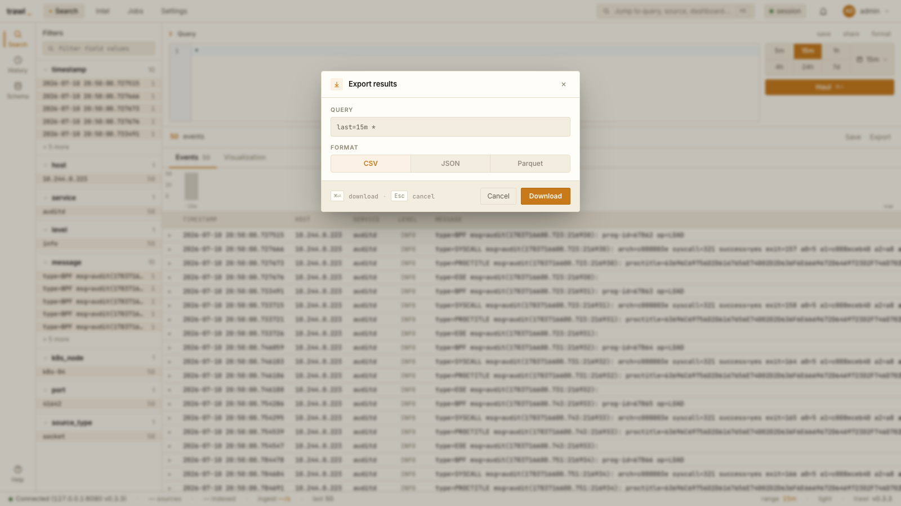
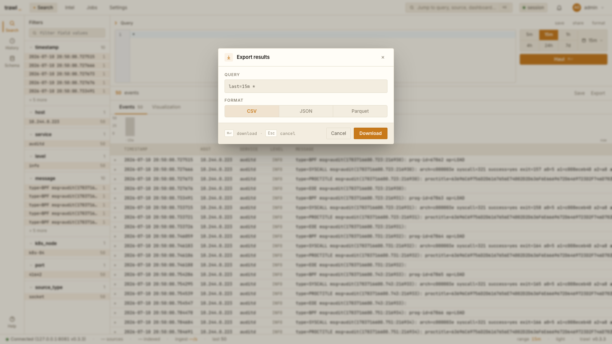
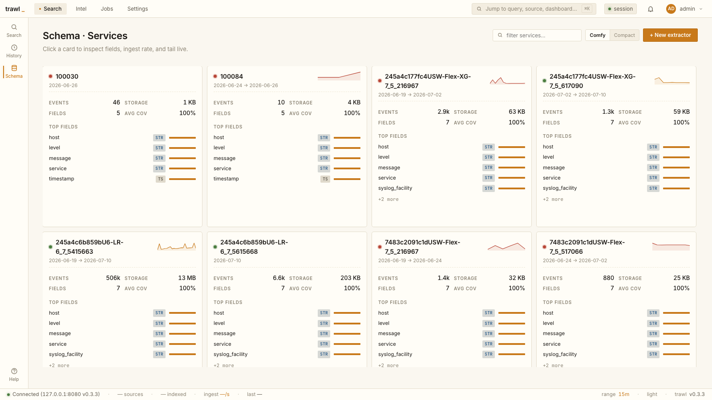
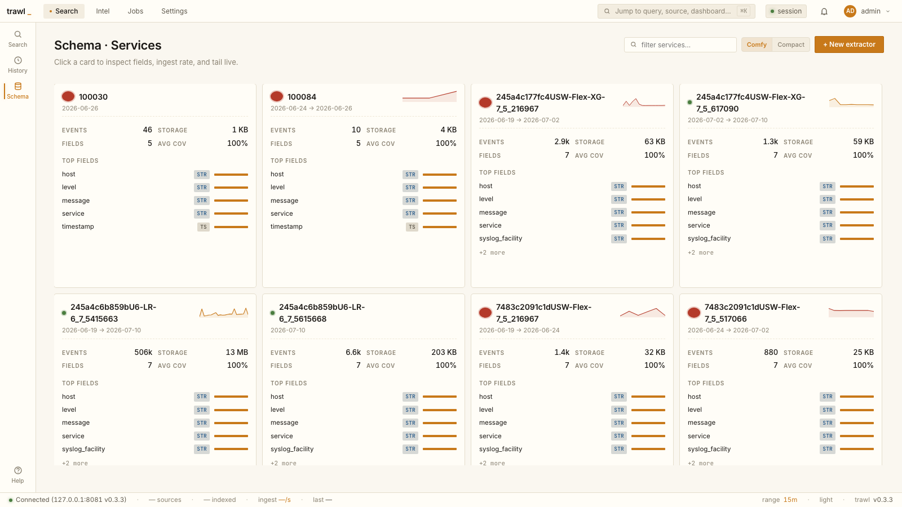
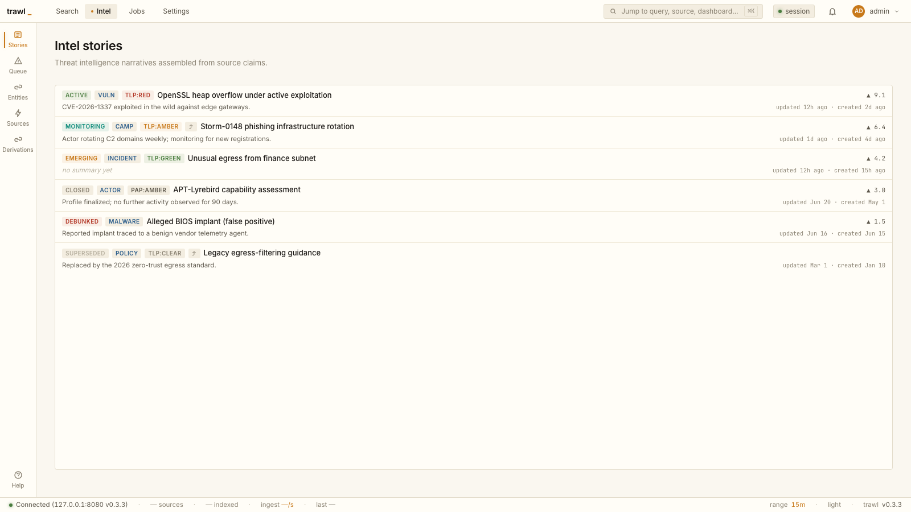
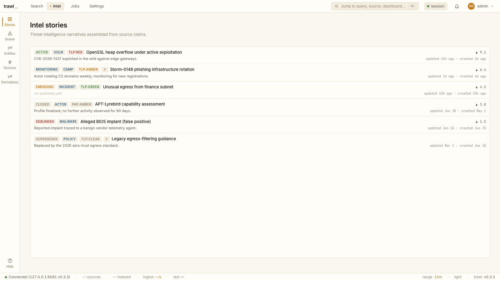
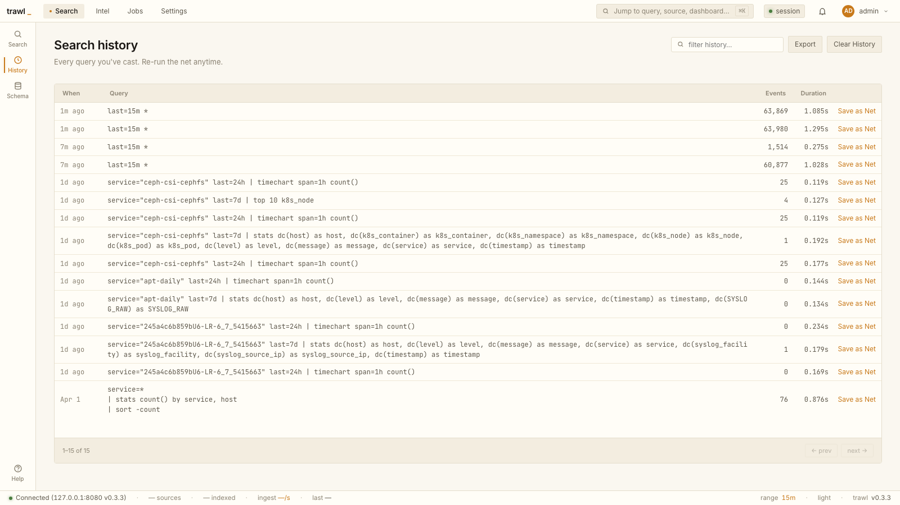
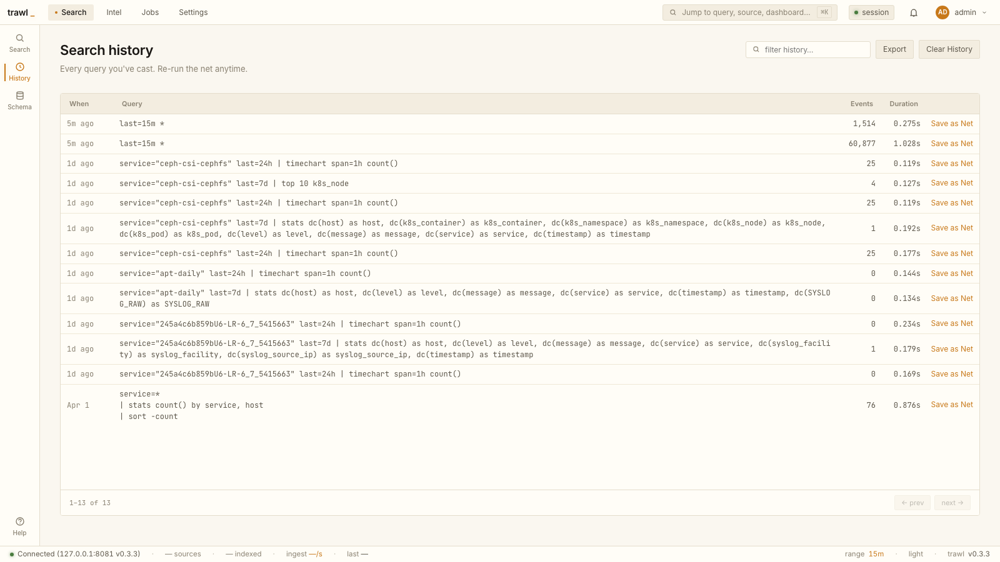
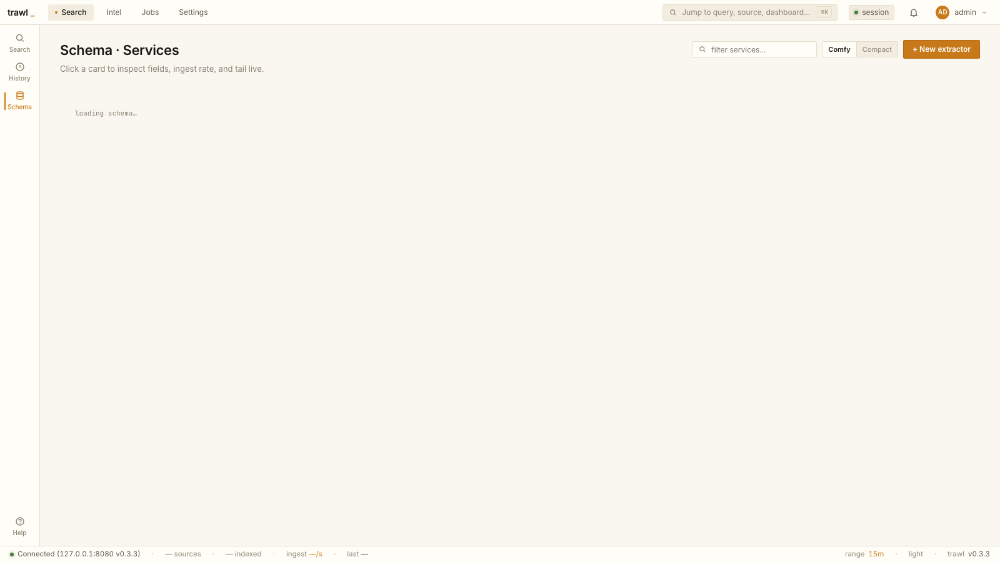

# Issue #31 — C8 before/after visual evidence

Slice C of the fleet-ui extraction (ADR-0002/ADR-0003) unifies ten
generic-by-nature small widgets onto one canonical treatment each. Per the
issue, this slice **relaxes** the zero-visual-change gate that governed
slice B — the visual deltas below are **intentional unification**, not
regressions, so this is documentary before/after evidence rather than a
pixel-parity gate.

- **before** = the PR merge-base (`30e2fe7`, pre-unification)
- **after** = this branch (`feat/issue-31-fleet-ui-small-widgets`)

Both builds render the **same live homelab data** (one trawld upstream), so
only the chrome differs. Captured at a fixed 1600×900 viewport in both the
light (nord) and dark themes. The `:8080` (before) vs `:8081` (after) host
label in the status bar is the only benign delta — the two-port capture
method documented in `scripts/web-visual-parity`.

## Surfaces

Each row: `before/<id>.<theme>.png` ↔ `after/<id>.<theme>.png`.

### 1. Export-modal format row (`export-modal`)

The Segmented control's canonical reference: the CSV/JSON/Parquet row was
already the amber-wash active treatment, so it is unchanged — it is the
target look every other segmented control now matches.

| before | after |
|---|---|
|  |  |

### 2. Schema density toggle (`schema`)

`Comfy | Compact` (top-right). **Before**: active segment is the old
dark/inverse `seg-mini` fill. **After**: active segment is the unified
amber-wash `Segmented` treatment (matching the export-modal format row).
The service-card **status dots** also unify here — 6px flat → 7px ringed.

| before | after |
|---|---|
|  |  |

### 3. Intel badges (`stories`)

The headline unification: 22 per-call inline badge palettes collapse to the
5-tone `Badge` set. Canned intel data exercises every tone —
`ACTIVE`/`EMERGING`/`CLOSED`/`DEBUNKED` states, class chips (`Tone::Info`),
and TLP/PAP markings (`RED`→Danger, `AMBER`→Warn, `GREEN`→Success, else
Neutral). The visible delta: the `MONITORING` state chip drops its teal wash
to Info/Neutral, and the one-off 9px / non-uppercase variants collapse onto
the canonical 10px uppercase chip.

| before | after |
|---|---|
|  |  |

### 4. History pager (`history`)

The `.tbl-foot` table footer collapses onto the canonical `Pager`
(`.results-footer`) — panel bg + 8px pad, Sm buttons.

| before | after |
|---|---|
|  |  |

### 5. Loading state (`loading`)

Schema data call delayed so the tri-state `Loaded` hint stays on screen.
The copy normalizes to the canonical `loading {label}…` in the `.load-hint`
treatment (before renders it in the old mono style; after in the proportional
`.load-hint`).

| before | after |
|---|---|
|  |  |

Dark-theme captures for every surface sit alongside each light shot
(`*.dark.png`).

## Reproduction

Method is pinned in `scripts/web-visual-parity` (two-build capture). This
run's concrete steps:

1. `trunk build` the SPA at the merge-base and at HEAD into isolated
   `dist/` dirs.
2. Run two `trawl-web` proxies (`:8080` before, `:8081` after) via
   `TRAWL_WEB_SPA_DIR`, both pointing `[web].upstream_url` at one live
   trawld and `[web].coastwatch_url` at a small mock returning a canned
   `stories` list (so the intel badge tones render deterministically).
3. Drive a headless Chromium (playwright) through login
   (`POST /api/auth/login`), seed the theme via `localStorage["trawl.ui"]`,
   and capture each surface. Modal/loading states are reached by clicking
   Export and by delaying the `schema/services` response, respectively.
