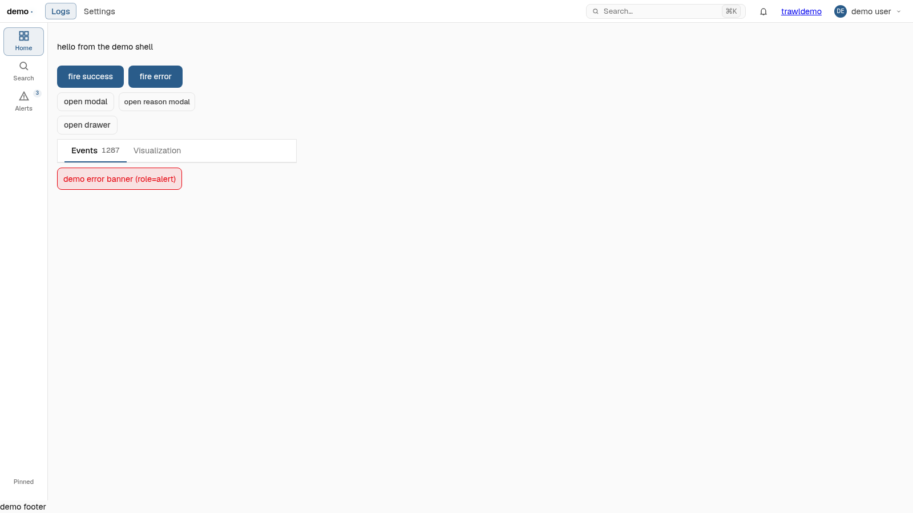
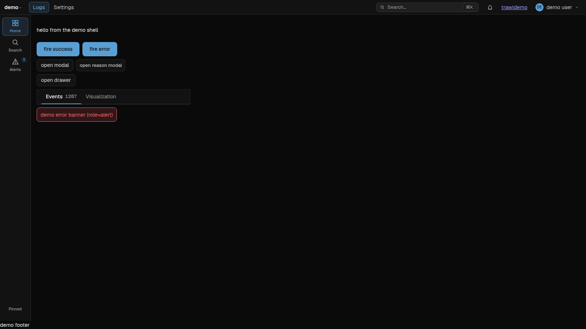
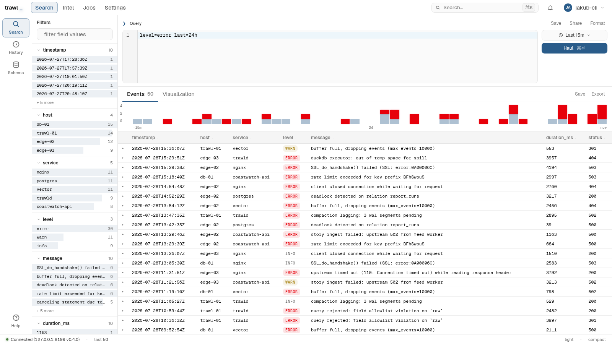
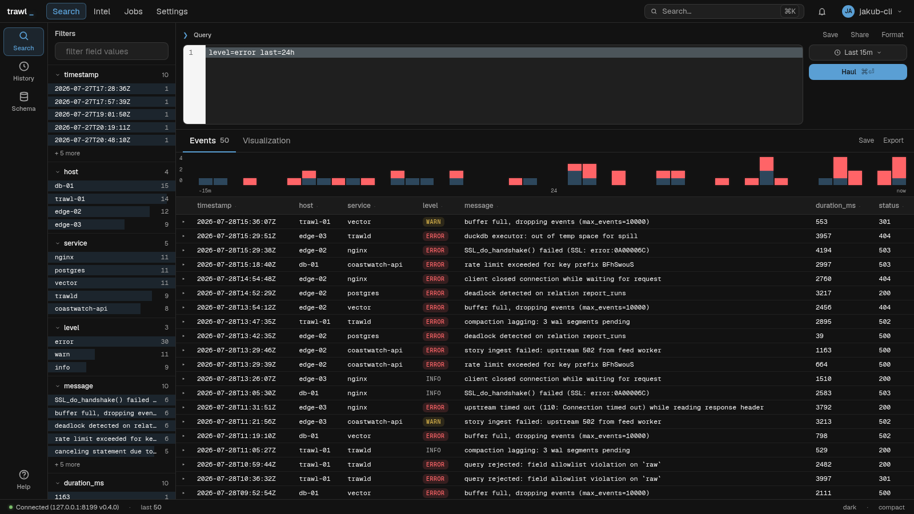

# Issue #47 — AC7 Mira Blue visual QA

The four AC7 captures: **shell_demo** and the **trawl-web-ui search page**,
each in light and dark. Both builds are the Mira Blue port at branch HEAD
(`8fc4bfd`) — there is no before/after grid here, because ADR-0007 is a
deliberate design-language change, not a parity migration (contrast
`issue-31/`, which gates on pixels).

Fixed 1600×900 viewport, headless Chromium, `device-scale-factor` 1.

## Surfaces

### 1. fleet-ui `shell_demo` (`crates/fleet-ui`)

The design system on its own: Shell + Rail + TopBar, the button recipes
(primary / secondary / ghost), Tabs, and the error banner.

| light | dark |
|---|---|
|  |  |

What to look for against ADR-0007:

- **Accent** — `#2a5c8a` fills the primaries in light; dark inverts to the
  `#5a9fd4` fill carrying near-black `--on-accent` label text (the "fire
  success" / "fire error" pair is the clearest read).
- **Secondary/ghost** — outline treatment: transparent fill in light, a
  `color-mix(line 30%)` fill in dark, never a solid slab.
- **Radii** — 8px `--radius-ctl` on every button; the tab strip and rail
  chips sit on 6px `--radius-sm`.
- **Surfaces** — neutral OKLCH ramp end to end; no blue cast in the
  panel/line tokens, only in the accent.

### 2. trawl-web-ui `/search` (`crates/trawl-web-ui`)

The app surface AC7 names: facet sidebar, DSL editor, range trigger, run
button, histogram strip, results table, status bar.

| light | dark |
|---|---|
|  |  |

What to look for:

- **Run button** — the dark-mode inversion again, on the surface the ADR
  calls out by name: light-blue `Haul ⌘⏎` fill with near-black text.
- **Editor + range trigger** — translucent `--fill` wash over the panel,
  8px radius, no hard-coded grey.
- **Chips / facet rows** — 6px, and the level badges keep their semantic
  hues (`--red` / `--yellow`) rather than inheriting the accent.
- **Field-type colours** — the facet counts and histogram bars stay
  separable from the accent blue after the remap.
- **Native chrome** — the facet filter input renders with the theme's own
  `color-scheme`, so its placeholder and caret invert instead of staying
  light-mode UA defaults.

## Reproduction

Both builds are plain `trunk build` output at HEAD, served statically —
the SPA is CSR, so a static host plus canned `/api/*` answers is enough to
render `/search` fully. No live trawld, no postgres, no session cookie.

1. `(cd crates/fleet-ui && trunk build)` and
   `(cd crates/trawl-web-ui && trunk build)`.
2. Serve `crates/fleet-ui/dist` with any static server — `shell_demo` is
   a single route and needs no backend.
3. Serve `crates/trawl-web-ui/dist` behind a stand-in that (a) falls back
   to `index.html` for non-`/api` paths so the wasm router owns `/search`,
   and (b) answers exactly four calls:

   | request | canned response |
   |---|---|
   | `GET /api/auth/me` | `MeResponse` — any `name` / `roles` / non-admin `permissions` / future `exp`. **This is the gate**: `AuthShell` redirects to `/login` when it fails, which is why a bare static `dist/` only ever renders the 404 route. |
   | `GET /api/v1/health` | `HealthResponse` — drives the status-bar pill. |
   | `GET /api/v1/saved` | `ListSavedResponse`. |
   | `POST /api/v1/query` | `QueryResponse` — 50 rows over `timestamp, host, service, level, message, duration_ms, status`. A `timestamp` column feeds the histogram and `level == "error"` its error stack, so seed both to exercise the strip. |

   Keep `permissions` non-admin: `server_manage` opens the footer's
   `/api/v1/stream` EventSource, which a canned backend has no reason to
   serve.
4. Browse `/search?q=level%3Derror+last%3D24h` (the query has to be in the
   URL — `executed_q` is a URL memo, and an empty `q` short-circuits the
   resource without a round trip).
5. Seed the theme before load rather than clicking the status-bar toggle:
   `localStorage["trawl.ui"] = {"theme":"light"|"dark","density":"compact","rowstyle":"bordered"}`
   for the SPA, `localStorage["fleet-ui-demo:prefs"]` (same shape) for
   shell_demo, then reload and capture.

The rows are canned, not live homelab data — the chrome is what AC7 gates
on, and canned rows make the capture deterministic. The status bar
therefore reads the capture host (`127.0.0.1:8199`) rather than a real
upstream.
